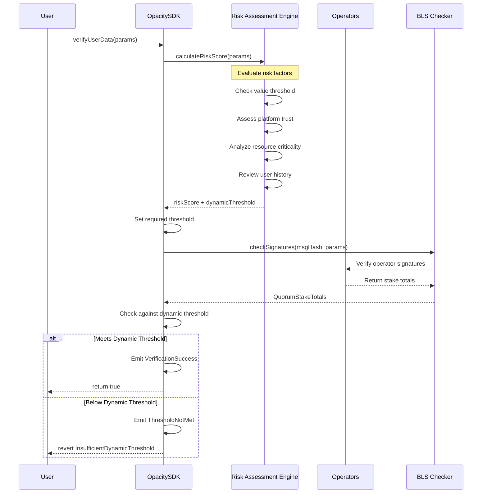
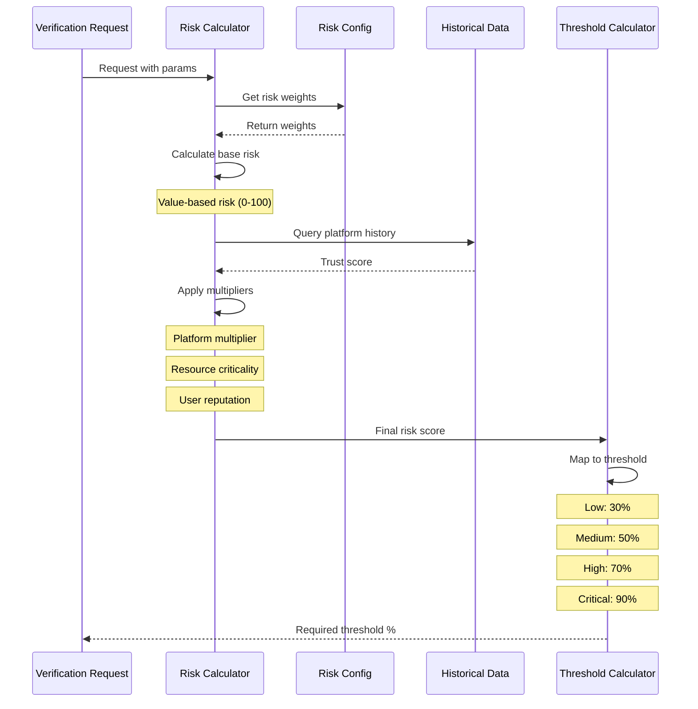

# Add Dynamic Security Threshold Based on Risk Assessment

## Introduction

This issue proposes implementing a **Dynamic Security Threshold** system for the OpacitySDK that automatically adjusts the required quorum percentage based on risk factors associated with each verification request. Instead of using a static threshold (currently 1% as QUORUM_THRESHOLD), the system will evaluate multiple risk parameters to determine the appropriate security level for each verification, providing adaptive security that scales with risk.

## Problem Statement

The current OpacitySDK uses a fixed quorum threshold for all verifications, regardless of the sensitivity or value of the operation being verified. This one-size-fits-all approach presents several limitations:

**Current Issues:**
- **Inefficient Resource Usage**: Low-risk operations require the same operator participation as high-risk ones
- **Insufficient Security Flexibility**: High-value operations may need stronger consensus than the fixed threshold provides
- **No Risk Differentiation**: All verifications are treated equally regardless of platform, resource type, or transaction value
- **Static Security Model**: Cannot adapt to changing threat landscapes or network conditions
- **Poor Economics**: Operators waste resources on trivial verifications while critical operations may be under-secured

**Example Scenarios:**
- Verifying a social media follower count (low risk) requires the same threshold as verifying a large financial transaction (high risk)
- A new, untrusted platform receives the same security treatment as an established, audited platform
- Emergency situations cannot trigger heightened security requirements

## Background

### Current Threshold Implementation

The current system uses static constants for threshold validation:

```solidity
uint8 public constant THRESHOLD_DENOMINATOR = 100;
uint8 public QUORUM_THRESHOLD = 1; // 1% minimum
```

This means only 1% of the stake needs to sign for any verification to pass, which is extremely low and doesn't account for risk factors.

### Risk-Based Security Models

Modern security systems implement adaptive thresholds based on:
- **Transaction Value**: Higher values require stronger consensus
- **Operation Type**: Critical operations need more validation
- **Historical Behavior**: New users/platforms require stricter verification
- **Network Conditions**: Adjust based on operator availability and network health
- **Threat Intelligence**: Respond to detected attack patterns

### EigenLayer Stake-Weighted Voting

The system leverages EigenLayer's stake-weighted voting, where operator influence is proportional to their economic stake. Dynamic thresholds can better utilize this economic security model.

## Proposed Solution

### Dynamic Threshold Architecture

The system will calculate thresholds based on a multi-factor risk scoring engine:



### Risk Assessment Flow



## Code Implementation

### Enhanced OpacitySDK with Dynamic Thresholds

```solidity
// SPDX-License-Identifier: AGPL-3.0-only
pragma solidity ^0.8.30;

import "@eigenlayer-middleware/BLSSignatureChecker.sol";
import {
    IBLSSignatureChecker, 
    IBLSSignatureCheckerTypes
} from "@eigenlayer-middleware/interfaces/IBLSSignatureChecker.sol";

abstract contract OpacitySDK {
    // Risk levels for threshold calculation
    enum RiskLevel {
        MINIMAL,    // 10% threshold
        LOW,        // 30% threshold
        MEDIUM,     // 50% threshold
        HIGH,       // 70% threshold
        CRITICAL    // 90% threshold
    }
    
    // Platform trust levels
    enum PlatformTrust {
        UNTRUSTED,  // New or suspicious platform
        BASIC,      // Some history, limited trust
        VERIFIED,   // Verified platform with good history
        TRUSTED     // Long-term trusted partner
    }
    
    // Resource criticality levels
    enum ResourceCriticality {
        TRIVIAL,    // e.g., social media metrics
        STANDARD,   // e.g., user preferences
        SENSITIVE,  // e.g., personal data
        CRITICAL    // e.g., financial data, credentials
    }
    
    struct VerificationParams {
        bytes quorumNumbers;
        uint32 referenceBlockNumber;
        IBLSSignatureCheckerTypes.NonSignerStakesAndSignature nonSignerStakesAndSignature;
        address userAddress;
        string platform;
        string resource;
        string value;
        uint256 operatorThreshold;
        string signature;
    }
    
    struct RiskConfig {
        uint256 lowValueThreshold;      // Below this = low risk
        uint256 mediumValueThreshold;   // Below this = medium risk
        uint256 highValueThreshold;     // Below this = high risk
        uint8 platformMultiplier;       // 0-200, affects threshold
        uint8 resourceMultiplier;       // 0-200, affects threshold
        bool emergencyMode;              // Force maximum threshold
    }
    
    // State variables
    BLSSignatureChecker public immutable blsSignatureChecker;
    uint8 public constant THRESHOLD_DENOMINATOR = 100;
    uint32 public BLOCK_STALE_MEASURE = 300;
    
    // Dynamic threshold configuration
    RiskConfig public riskConfig;
    mapping(string => PlatformTrust) public platformTrustLevels;
    mapping(string => ResourceCriticality) public resourceCriticalityLevels;
    mapping(address => uint256) public userVerificationCount;
    mapping(address => uint256) public userLastVerification;
    
    // Threshold mappings (in percentage)
    mapping(RiskLevel => uint8) public riskThresholds;
    
    // Events
    event DynamicThresholdApplied(
        bytes32 indexed msgHash,
        RiskLevel riskLevel,
        uint8 requiredThreshold,
        uint8 actualThreshold
    );
    event RiskConfigUpdated(RiskConfig newConfig);
    event PlatformTrustUpdated(string platform, PlatformTrust trust);
    event ResourceCriticalityUpdated(string resource, ResourceCriticality criticality);
    
    // Custom errors
    error InsufficientDynamicThreshold(uint8 required, uint8 actual);
    error InvalidRiskConfiguration();
    error EmergencyModeActive();
    
    constructor(address _blsSignatureChecker) {
        require(_blsSignatureChecker != address(0), "Invalid BLS checker");
        blsSignatureChecker = BLSSignatureChecker(_blsSignatureChecker);
        
        // Initialize default thresholds
        riskThresholds[RiskLevel.MINIMAL] = 10;
        riskThresholds[RiskLevel.LOW] = 30;
        riskThresholds[RiskLevel.MEDIUM] = 50;
        riskThresholds[RiskLevel.HIGH] = 70;
        riskThresholds[RiskLevel.CRITICAL] = 90;
        
        // Initialize default risk config
        riskConfig = RiskConfig({
            lowValueThreshold: 100 ether,
            mediumValueThreshold: 1000 ether,
            highValueThreshold: 10000 ether,
            platformMultiplier: 100,  // 100% = no change
            resourceMultiplier: 100,  // 100% = no change
            emergencyMode: false
        });
    }
    
    function verify(VerificationParams calldata params) external returns (bool success) {
        // Emergency mode check
        if (riskConfig.emergencyMode) {
            revert EmergencyModeActive();
        }
        
        // Calculate message hash
        bytes32 msgHash = keccak256(
            abi.encode(
                params.userAddress,
                params.platform,
                params.resource,
                params.value,
                params.operatorThreshold,
                params.signature
            )
        );
        
        // Calculate dynamic threshold based on risk assessment
        (RiskLevel riskLevel, uint8 requiredThreshold) = calculateDynamicThreshold(params);
        
        // Get signature verification results
        (IBLSSignatureCheckerTypes.QuorumStakeTotals memory stakeTotals,) = 
            blsSignatureChecker.checkSignatures(
                msgHash, 
                params.quorumNumbers, 
                params.referenceBlockNumber, 
                params.nonSignerStakesAndSignature
            );
        
        // Calculate actual threshold achieved
        uint8 actualThreshold = 0;
        for (uint256 i = 0; i < params.quorumNumbers.length; i++) {
            uint256 signedPercentage = (stakeTotals.signedStakeForQuorum[i] * 100) / 
                                       stakeTotals.totalStakeForQuorum[i];
            if (signedPercentage < requiredThreshold) {
                revert InsufficientDynamicThreshold(requiredThreshold, uint8(signedPercentage));
            }
            actualThreshold = uint8(signedPercentage);
        }
        
        // Update user statistics
        userVerificationCount[params.userAddress]++;
        userLastVerification[params.userAddress] = block.timestamp;
        
        // Emit event with threshold details
        emit DynamicThresholdApplied(msgHash, riskLevel, requiredThreshold, actualThreshold);
        
        return true;
    }
    
    function calculateDynamicThreshold(
        VerificationParams calldata params
    ) public view returns (RiskLevel riskLevel, uint8 threshold) {
        uint256 riskScore = 0;
        
        // 1. Value-based risk assessment (0-40 points)
        if (params.operatorThreshold <= riskConfig.lowValueThreshold) {
            riskScore += 10;
        } else if (params.operatorThreshold <= riskConfig.mediumValueThreshold) {
            riskScore += 20;
        } else if (params.operatorThreshold <= riskConfig.highValueThreshold) {
            riskScore += 30;
        } else {
            riskScore += 40;
        }
        
        // 2. Platform trust assessment (0-30 points)
        PlatformTrust platformTrust = platformTrustLevels[params.platform];
        if (platformTrust == PlatformTrust.UNTRUSTED) {
            riskScore += 30;
        } else if (platformTrust == PlatformTrust.BASIC) {
            riskScore += 20;
        } else if (platformTrust == PlatformTrust.VERIFIED) {
            riskScore += 10;
        }
        // TRUSTED adds 0 points
        
        // 3. Resource criticality assessment (0-30 points)
        ResourceCriticality resourceCrit = resourceCriticalityLevels[params.resource];
        if (resourceCrit == ResourceCriticality.CRITICAL) {
            riskScore += 30;
        } else if (resourceCrit == ResourceCriticality.SENSITIVE) {
            riskScore += 20;
        } else if (resourceCrit == ResourceCriticality.STANDARD) {
            riskScore += 10;
        }
        // TRIVIAL adds 0 points
        
        // 4. User history bonus (reduces risk)
        uint256 userVerifications = userVerificationCount[params.userAddress];
        if (userVerifications > 100) {
            riskScore = riskScore > 10 ? riskScore - 10 : 0;
        } else if (userVerifications > 50) {
            riskScore = riskScore > 5 ? riskScore - 5 : 0;
        }
        
        // Map risk score to risk level
        if (riskScore <= 20) {
            riskLevel = RiskLevel.MINIMAL;
        } else if (riskScore <= 40) {
            riskLevel = RiskLevel.LOW;
        } else if (riskScore <= 60) {
            riskLevel = RiskLevel.MEDIUM;
        } else if (riskScore <= 80) {
            riskLevel = RiskLevel.HIGH;
        } else {
            riskLevel = RiskLevel.CRITICAL;
        }
        
        // Apply multipliers
        threshold = riskThresholds[riskLevel];
        threshold = uint8((threshold * riskConfig.platformMultiplier) / 100);
        threshold = uint8((threshold * riskConfig.resourceMultiplier) / 100);
        
        // Ensure threshold is within valid range
        if (threshold > 95) threshold = 95;
        if (threshold < 5) threshold = 5;
        
        return (riskLevel, threshold);
    }
    
    // Admin functions
    function updateRiskConfig(RiskConfig memory newConfig) external onlyOwner {
        require(newConfig.platformMultiplier <= 200, InvalidRiskConfiguration());
        require(newConfig.resourceMultiplier <= 200, InvalidRiskConfiguration());
        riskConfig = newConfig;
        emit RiskConfigUpdated(newConfig);
    }
    
    function setPlatformTrust(
        string memory platform, 
        PlatformTrust trust
    ) external onlyOwner {
        platformTrustLevels[platform] = trust;
        emit PlatformTrustUpdated(platform, trust);
    }
    
    function setResourceCriticality(
        string memory resource, 
        ResourceCriticality criticality
    ) external onlyOwner {
        resourceCriticalityLevels[resource] = criticality;
        emit ResourceCriticalityUpdated(resource, criticality);
    }
    
    function setRiskThreshold(
        RiskLevel level, 
        uint8 threshold
    ) external onlyOwner {
        require(threshold <= 95 && threshold >= 5, "Invalid threshold");
        riskThresholds[level] = threshold;
    }
    
    function toggleEmergencyMode() external onlyOwner {
        riskConfig.emergencyMode = !riskConfig.emergencyMode;
    }
}
```

### Example Consumer with Dynamic Thresholds

```solidity
// SPDX-License-Identifier: MIT
pragma solidity ^0.8.30;

import "../OpacitySDK.sol";

contract DynamicVerificationConsumer is OpacitySDK {
    
    struct VerificationResult {
        bool verified;
        RiskLevel riskLevel;
        uint8 thresholdRequired;
        uint256 timestamp;
    }
    
    mapping(bytes32 => VerificationResult) public verificationHistory;
    
    event VerificationAttempt(
        address indexed user,
        string platform,
        string resource,
        RiskLevel riskLevel,
        uint8 threshold,
        bool success
    );
    
    constructor(address _blsSignatureChecker) OpacitySDK(_blsSignatureChecker) {
        // Initialize common platforms
        setPlatformTrust("twitter", PlatformTrust.VERIFIED);
        setPlatformTrust("github", PlatformTrust.VERIFIED);
        setPlatformTrust("discord", PlatformTrust.BASIC);
        
        // Initialize common resources
        setResourceCriticality("followers", ResourceCriticality.TRIVIAL);
        setResourceCriticality("balance", ResourceCriticality.CRITICAL);
        setResourceCriticality("identity", ResourceCriticality.SENSITIVE);
        setResourceCriticality("score", ResourceCriticality.STANDARD);
    }
    
    function verifyWithDynamicThreshold(
        VerificationParams calldata params
    ) external returns (bool verified, RiskLevel riskLevel, uint8 threshold) {
        // Pre-calculate risk for transparency
        (riskLevel, threshold) = calculateDynamicThreshold(params);
        
        // Log the attempt
        emit VerificationAttempt(
            params.userAddress,
            params.platform,
            params.resource,
            riskLevel,
            threshold,
            false // Will update if successful
        );
        
        try this.verify(params) returns (bool success) {
            if (success) {
                // Store successful verification
                bytes32 verificationId = keccak256(
                    abi.encode(params.userAddress, params.platform, params.resource)
                );
                
                verificationHistory[verificationId] = VerificationResult({
                    verified: true,
                    riskLevel: riskLevel,
                    thresholdRequired: threshold,
                    timestamp: block.timestamp
                });
                
                emit VerificationAttempt(
                    params.userAddress,
                    params.platform,
                    params.resource,
                    riskLevel,
                    threshold,
                    true
                );
            }
            return (success, riskLevel, threshold);
        } catch {
            return (false, riskLevel, threshold);
        }
    }
    
    function getRecommendedThreshold(
        string memory platform,
        string memory resource,
        uint256 value
    ) external view returns (RiskLevel, uint8) {
        VerificationParams memory params;
        params.platform = platform;
        params.resource = resource;
        params.operatorThreshold = value;
        params.userAddress = msg.sender;
        
        return calculateDynamicThreshold(params);
    }
}
```

### Risk Configuration Management Contract

```solidity
// SPDX-License-Identifier: MIT
pragma solidity ^0.8.30;

contract RiskConfigurationManager {
    
    struct PlatformConfig {
        PlatformTrust trustLevel;
        uint256 verificationCount;
        uint256 lastIncident;
        bool isActive;
    }
    
    struct ResourceConfig {
        ResourceCriticality criticality;
        uint256 customThreshold;
        bool useCustomThreshold;
    }
    
    mapping(string => PlatformConfig) public platforms;
    mapping(string => ResourceConfig) public resources;
    
    event PlatformRiskUpdated(
        string platform,
        PlatformTrust oldTrust,
        PlatformTrust newTrust,
        string reason
    );
    
    function adjustPlatformTrust(
        string memory platform,
        bool increase
    ) external onlyOwner {
        PlatformConfig storage config = platforms[platform];
        PlatformTrust oldTrust = config.trustLevel;
        
        if (increase) {
            if (config.trustLevel == PlatformTrust.UNTRUSTED) {
                config.trustLevel = PlatformTrust.BASIC;
            } else if (config.trustLevel == PlatformTrust.BASIC) {
                config.trustLevel = PlatformTrust.VERIFIED;
            } else if (config.trustLevel == PlatformTrust.VERIFIED) {
                config.trustLevel = PlatformTrust.TRUSTED;
            }
        } else {
            if (config.trustLevel == PlatformTrust.TRUSTED) {
                config.trustLevel = PlatformTrust.VERIFIED;
            } else if (config.trustLevel == PlatformTrust.VERIFIED) {
                config.trustLevel = PlatformTrust.BASIC;
            } else if (config.trustLevel == PlatformTrust.BASIC) {
                config.trustLevel = PlatformTrust.UNTRUSTED;
            }
        }
        
        emit PlatformRiskUpdated(
            platform,
            oldTrust,
            config.trustLevel,
            increase ? "Trust increased" : "Trust decreased"
        );
    }
    
    function reportIncident(string memory platform) external onlyOwner {
        platforms[platform].lastIncident = block.timestamp;
        // Automatically reduce trust on incident
        adjustPlatformTrust(platform, false);
    }
}
```

## Testing Strategy

### Unit Tests

```solidity
function testMinimalRiskThreshold() public {
    VerificationParams memory params = createLowRiskParams();
    (RiskLevel level, uint8 threshold) = sdk.calculateDynamicThreshold(params);
    
    assertEq(uint8(level), uint8(RiskLevel.MINIMAL));
    assertEq(threshold, 10);
}

function testCriticalRiskThreshold() public {
    VerificationParams memory params = createHighValueParams();
    params.platform = "unknown_platform"; // Untrusted
    params.resource = "private_key"; // Critical resource
    
    (RiskLevel level, uint8 threshold) = sdk.calculateDynamicThreshold(params);
    
    assertEq(uint8(level), uint8(RiskLevel.CRITICAL));
    assertGe(threshold, 85);
}

function testUserHistoryReducesThreshold() public {
    address testUser = address(0x123);
    
    // Simulate user history
    for (uint i = 0; i < 101; i++) {
        sdk.incrementUserVerifications(testUser);
    }
    
    VerificationParams memory params = createStandardParams();
    params.userAddress = testUser;
    
    (RiskLevel level, uint8 threshold) = sdk.calculateDynamicThreshold(params);
    
    // Should be lower due to user history
    assertLt(threshold, 50);
}

function testEmergencyModeBlocks() public {
    sdk.toggleEmergencyMode();
    
    VerificationParams memory params = createStandardParams();
    
    vm.expectRevert(EmergencyModeActive.selector);
    sdk.verify(params);
}

function testDynamicThresholdEnforcement() public {
    VerificationParams memory params = createHighRiskParams();
    
    // Mock insufficient signatures (only 50% when 70% required)
    mockBLSSignatures(50);
    
    vm.expectRevert(
        abi.encodeWithSelector(InsufficientDynamicThreshold.selector, 70, 50)
    );
    sdk.verify(params);
}
```

## Security Considerations

1. **Threshold Manipulation**: Ensure only authorized entities can modify risk configurations
2. **Risk Score Gaming**: Prevent users from manipulating parameters to achieve lower thresholds
3. **Emergency Response**: Emergency mode allows immediate response to threats
4. **Gradual Trust Building**: New platforms start untrusted and build reputation over time
5. **Threshold Bounds**: Enforce minimum (5%) and maximum (95%) thresholds to prevent extremes

## Benefits

1. **Adaptive Security**: Security scales with actual risk
2. **Resource Efficiency**: Low-risk operations require fewer operators
3. **Enhanced Protection**: High-value operations get stronger consensus
4. **Flexible Configuration**: Admins can tune risk parameters
5. **User Experience**: Faster verification for routine operations
6. **Economic Optimization**: Better allocation of operator resources
7. **Incident Response**: Can quickly adjust thresholds in response to threats

## Implementation Roadmap

### Phase 1: Core Implementation
- [ ] Implement risk scoring engine
- [ ] Add dynamic threshold calculation
- [ ] Update verification logic
- [ ] Create admin configuration functions

### Phase 2: Risk Profiling
- [ ] Build platform trust database
- [ ] Categorize resource criticality
- [ ] Implement user reputation tracking
- [ ] Create risk analytics dashboard

### Phase 3: Machine Learning Integration
- [ ] Collect verification data for ML training
- [ ] Develop anomaly detection models
- [ ] Implement predictive risk scoring
- [ ] Create automated threshold adjustment

### Phase 4: Advanced Features
- [ ] Multi-factor risk assessment
- [ ] Time-based risk adjustments
- [ ] Geographic risk factors
- [ ] Cross-platform reputation sharing

## Open Questions

1. Should risk scores be publicly visible or kept private?
2. How frequently should platform trust levels be reviewed?
3. Should users be able to request specific threshold levels?
4. How should the system handle new platforms with no history?
5. Should there be a grace period for threshold changes?
6. How to prevent threshold shopping (trying multiple times for lower threshold)?

## Performance Considerations

- Risk calculation adds ~5000 gas to verification
- Storage of risk configurations requires additional slots
- Historical tracking increases storage requirements
- Consider using merkle trees for large platform/resource lists

## References

- [Risk-Based Authentication](https://www.nist.gov/publications/risk-based-authentication)
- [Adaptive Security Architecture](https://www.gartner.com/en/documents/2897717)
- [Dynamic Consensus Thresholds](https://arxiv.org/abs/2103.03853)
- [EigenLayer Docs - Stake Weighting](https://docs.eigenlayer.xyz/operators/stake-weighting)

---

**Labels:** `enhancement`, `security`, `risk-management`, `dynamic-threshold`
**Priority:** High
**Milestone:** v2.1.0
**Estimated Effort:** Large (3-4 weeks)