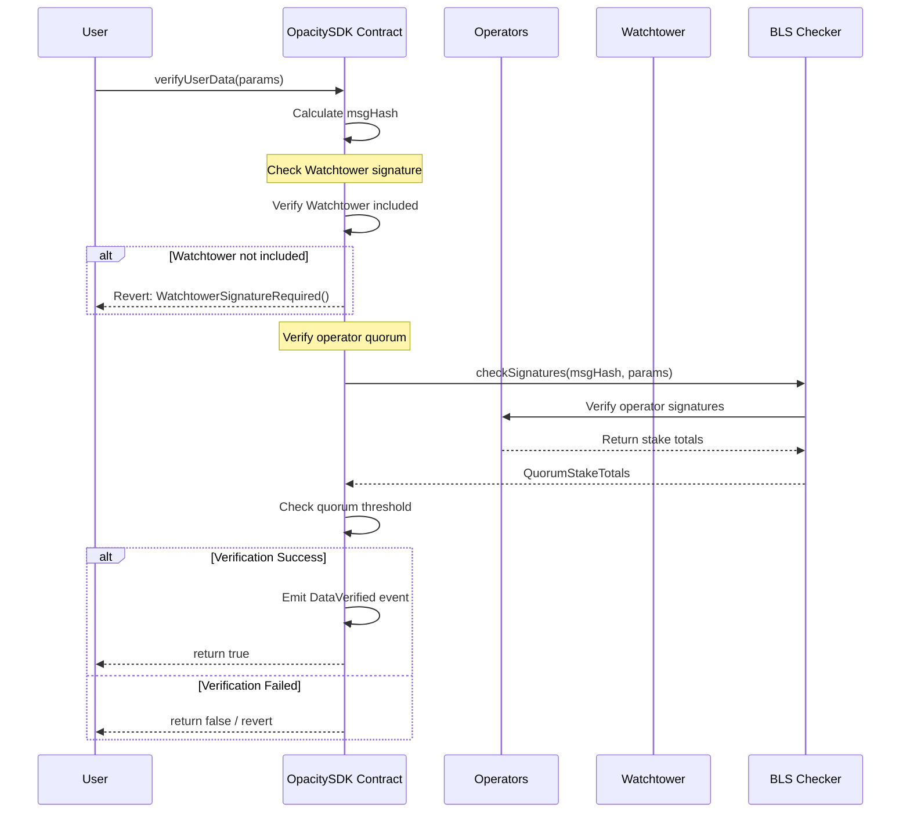
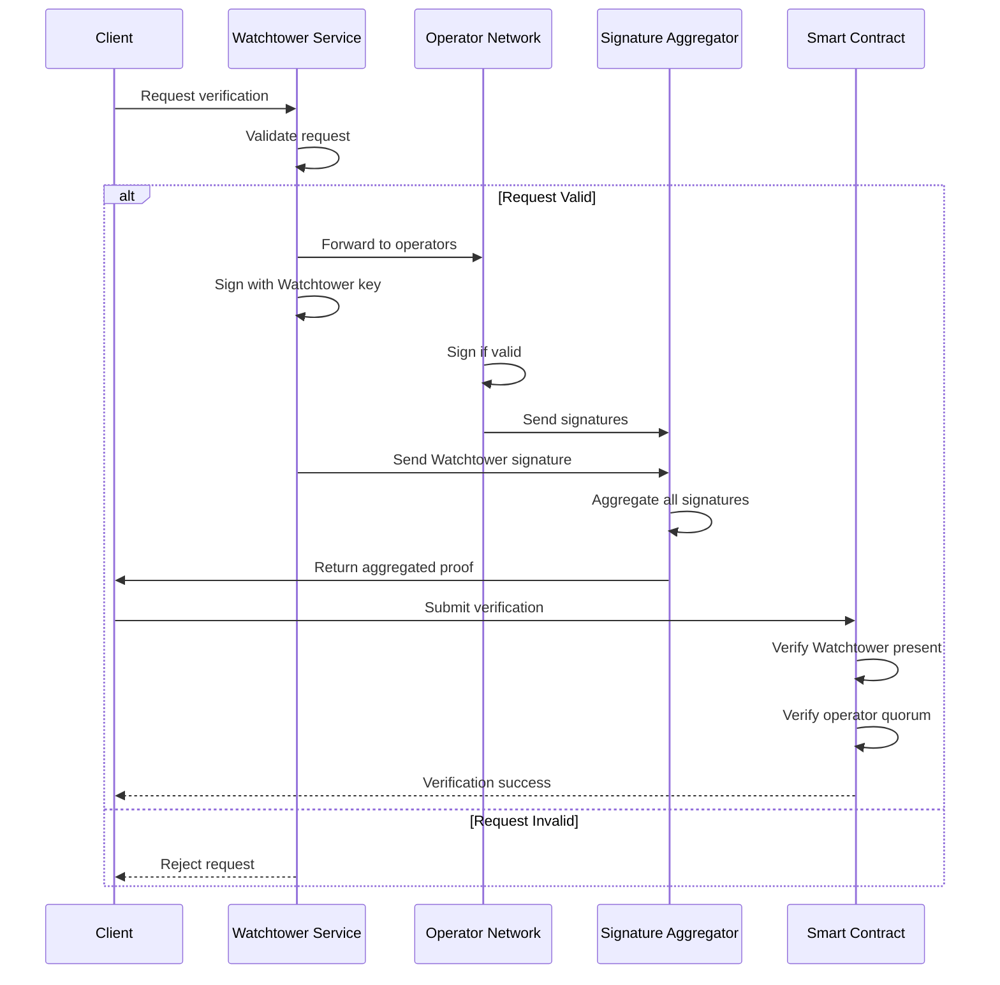

# Add Watchtower Signer Requirement for Verification

## Introduction

This issue proposes the addition of a **Watchtower** component to the OpacitySDK verification system. The Watchtower will act as a mandatory trusted signer that must participate in every verification for it to be considered valid. This enhancement will add an additional layer of security and trust to the verification process by ensuring that a designated, reliable entity oversees all verifications.

## Problem Statement

Currently, the OpacitySDK verification system relies solely on quorum-based BLS signature verification where any set of operators meeting the threshold requirements can validate a request. While this distributed approach provides decentralization, it lacks a mechanism to ensure that a trusted oversight entity participates in every verification.

**Key issues with the current system:**
- No guarantee that a trusted monitoring entity has reviewed the verification
- Potential for collusion among operators without detection
- Lack of centralized audit trail for compliance requirements
- No emergency circuit breaker in case of detected anomalies

## Background

### Current Verification Flow

The current OpacitySDK implements a threshold-based BLS signature verification system:

1. Multiple operators sign verification data
2. Signatures are aggregated using BLS cryptography
3. Verification passes if the signing operators meet the quorum threshold (currently 66%)
4. The system checks stake weights to ensure sufficient economic security

### BLS Signature Aggregation

BLS (Boneh-Lynn-Shacham) signatures allow multiple parties to sign a message and aggregate their signatures into a single compact signature. The current implementation uses this for efficient multi-operator verification.

### EigenLayer Integration

The system integrates with EigenLayer's middleware for operator management and stake tracking, providing economic security through slashing conditions.

## Proposed Solution

### Watchtower Architecture

The Watchtower will be implemented as a special signer with the following characteristics:

1. **Mandatory Participation**: Every verification must include the Watchtower's signature
2. **Separate Verification Path**: Watchtower signature verified independently from operator quorum
3. **Configurable Address**: Contract owner can update the Watchtower address
4. **Event Emission**: Special events for Watchtower-related actions

### Implementation Design



### Watchtower Verification Flow



## Code Implementation

### Updated OpacitySDK Contract

```solidity
// SPDX-License-Identifier: AGPL-3.0-only
pragma solidity ^0.8.30;

import "@eigenlayer-middleware/BLSSignatureChecker.sol";
import {
    IBLSSignatureChecker, 
    IBLSSignatureCheckerTypes
} from "@eigenlayer-middleware/interfaces/IBLSSignatureChecker.sol";

abstract contract OpacitySDK {
    // Existing struct with new field for watchtower signature
    struct VerificationParams {
        bytes quorumNumbers;
        uint32 referenceBlockNumber;
        IBLSSignatureCheckerTypes.NonSignerStakesAndSignature nonSignerStakesAndSignature;
        address userAddress;
        string platform;
        string resource;
        string value;
        uint256 operatorThreshold;
        string signature;
        bytes watchtowerSignature; // New field for watchtower signature
    }

    // Existing immutables
    BLSSignatureChecker public immutable blsSignatureChecker;
    
    // New watchtower state
    address public watchtowerAddress;
    bool public watchtowerEnabled;
    
    // Events
    event WatchtowerUpdated(address indexed oldWatchtower, address indexed newWatchtower);
    event WatchtowerStatusChanged(bool enabled);
    event WatchtowerVerification(bytes32 indexed msgHash, bool verified);
    
    // Custom errors
    error InvalidSignature();
    error InsufficientQuorumThreshold();
    error StaleBlockNumber();
    error FutureBlockNumber();
    error WatchtowerSignatureRequired();
    error InvalidWatchtowerSignature();
    error UnauthorizedWatchtowerUpdate();

    constructor(address _blsSignatureChecker, address _watchtowerAddress) {
        require(_blsSignatureChecker != address(0), "Invalid BLS signature checker");
        require(_watchtowerAddress != address(0), "Invalid watchtower address");
        
        blsSignatureChecker = BLSSignatureChecker(_blsSignatureChecker);
        watchtowerAddress = _watchtowerAddress;
        watchtowerEnabled = true;
    }

    function verify(VerificationParams calldata params) external view returns (bool success) {
        // Check block number validity
        require(params.referenceBlockNumber < block.number, FutureBlockNumber());
        require(
            (params.referenceBlockNumber + BLOCK_STALE_MEASURE) >= uint32(block.number), 
            StaleBlockNumber()
        );

        // Calculate message hash
        bytes32 msgHash = keccak256(
            abi.encode(
                params.userAddress,
                params.platform,
                params.resource,
                params.value,
                params.operatorThreshold,
                params.signature
            )
        );

        // Step 1: Verify watchtower signature if enabled
        if (watchtowerEnabled) {
            require(params.watchtowerSignature.length > 0, WatchtowerSignatureRequired());
            
            // Verify watchtower signature
            bool watchtowerValid = _verifyWatchtowerSignature(
                msgHash, 
                params.watchtowerSignature
            );
            require(watchtowerValid, InvalidWatchtowerSignature());
            
            emit WatchtowerVerification(msgHash, true);
        }

        // Step 2: Verify operator quorum (existing logic)
        (IBLSSignatureCheckerTypes.QuorumStakeTotals memory stakeTotals,) = 
            blsSignatureChecker.checkSignatures(
                msgHash, 
                params.quorumNumbers, 
                params.referenceBlockNumber, 
                params.nonSignerStakesAndSignature
            );

        // Check quorum thresholds
        for (uint256 i = 0; i < params.quorumNumbers.length; i++) {
            require(
                stakeTotals.signedStakeForQuorum[i] * THRESHOLD_DENOMINATOR
                    >= stakeTotals.totalStakeForQuorum[i] * QUORUM_THRESHOLD,
                InsufficientQuorumThreshold()
            );
        }

        return true;
    }

    function _verifyWatchtowerSignature(
        bytes32 msgHash, 
        bytes memory signature
    ) internal view returns (bool) {
        // Extract r, s, v from signature
        require(signature.length == 65, "Invalid signature length");
        
        bytes32 r;
        bytes32 s;
        uint8 v;
        
        assembly {
            r := mload(add(signature, 32))
            s := mload(add(signature, 64))
            v := byte(0, mload(add(signature, 96)))
        }
        
        // Recover signer address
        address signer = ecrecover(msgHash, v, r, s);
        return signer == watchtowerAddress;
    }

    // Admin functions
    function updateWatchtower(address newWatchtower) external onlyOwner {
        require(newWatchtower != address(0), "Invalid watchtower address");
        address oldWatchtower = watchtowerAddress;
        watchtowerAddress = newWatchtower;
        emit WatchtowerUpdated(oldWatchtower, newWatchtower);
    }

    function setWatchtowerStatus(bool enabled) external onlyOwner {
        watchtowerEnabled = enabled;
        emit WatchtowerStatusChanged(enabled);
    }
}
```

### Example Consumer Implementation

```solidity
// SPDX-License-Identifier: MIT
pragma solidity ^0.8.30;

import "../OpacitySDK.sol";

contract EnhancedVerificationConsumer is OpacitySDK {
    event DataVerified(
        address indexed user, 
        string platform, 
        string resource, 
        string value, 
        bool isValid,
        bool watchtowerVerified
    );

    constructor(
        address _blsSignatureChecker,
        address _watchtowerAddress
    ) OpacitySDK(_blsSignatureChecker, _watchtowerAddress) {}

    function verifyUserDataWithWatchtower(
        VerificationParams calldata params
    ) public returns (bool) {
        try this.verify(params) returns (bool verified) {
            emit DataVerified(
                params.userAddress, 
                params.platform, 
                params.resource, 
                params.value, 
                verified,
                watchtowerEnabled
            );
            return verified;
        } catch Error(string memory reason) {
            // Log specific error reasons
            if (keccak256(bytes(reason)) == keccak256(bytes("WatchtowerSignatureRequired()"))) {
                emit DataVerified(
                    params.userAddress, 
                    params.platform, 
                    params.resource, 
                    params.value, 
                    false,
                    false
                );
            }
            return false;
        }
    }
}
```

## Testing Strategy

### Unit Tests

```solidity
// Test watchtower signature validation
function testWatchtowerSignatureRequired() public {
    VerificationParams memory params = _createValidParams();
    params.watchtowerSignature = ""; // Empty watchtower signature
    
    vm.expectRevert(WatchtowerSignatureRequired.selector);
    sdk.verify(params);
}

function testValidWatchtowerSignature() public {
    VerificationParams memory params = _createValidParams();
    params.watchtowerSignature = _signWithWatchtower(params);
    
    bool result = sdk.verify(params);
    assertTrue(result);
}

function testInvalidWatchtowerSignature() public {
    VerificationParams memory params = _createValidParams();
    params.watchtowerSignature = _signWithWrongKey(params);
    
    vm.expectRevert(InvalidWatchtowerSignature.selector);
    sdk.verify(params);
}

function testWatchtowerCanBeDisabled() public {
    sdk.setWatchtowerStatus(false);
    
    VerificationParams memory params = _createValidParams();
    params.watchtowerSignature = ""; // No watchtower signature needed
    
    bool result = sdk.verify(params);
    assertTrue(result);
}
```

## Security Considerations

1. **Key Management**: Watchtower private key must be securely managed
2. **Single Point of Failure**: Watchtower becomes critical infrastructure
3. **Upgrade Path**: Need mechanism to rotate watchtower keys
4. **Emergency Procedures**: Ability to disable watchtower in emergencies
5. **Monitoring**: Watchtower uptime and response time monitoring

## Benefits

1. **Enhanced Security**: Additional verification layer prevents operator collusion
2. **Compliance**: Provides auditable oversight for regulatory requirements
3. **Emergency Response**: Can halt verifications if anomalies detected
4. **Trust Model**: Clear accountability through designated oversight entity
5. **Flexibility**: Can be enabled/disabled based on requirements

## Implementation Phases

### Phase 1: Core Implementation
- [ ] Update OpacitySDK contract with watchtower logic
- [ ] Add watchtower signature verification
- [ ] Implement admin functions for watchtower management
- [ ] Write comprehensive unit tests

### Phase 2: Integration
- [ ] Deploy watchtower service infrastructure
- [ ] Integrate with existing operator network
- [ ] Update client libraries to include watchtower signatures
- [ ] Documentation and developer guides

### Phase 3: Monitoring & Operations
- [ ] Set up monitoring dashboards
- [ ] Implement alerting systems
- [ ] Create key rotation procedures
- [ ] Establish incident response protocols

## Open Questions

1. Should the watchtower use BLS signatures for consistency or ECDSA for simplicity?
2. Should multiple watchtowers be supported for redundancy?
3. What should be the key rotation frequency?
4. Should watchtower participation be logged on-chain or off-chain?
5. How should watchtower downtime be handled?

## References

- [EigenLayer Middleware Documentation](https://docs.eigenlayer.xyz)
- [BLS Signature Scheme](https://www.iacr.org/archive/asiacrypt2001/22480516.pdf)
- [OpenZeppelin Access Control](https://docs.openzeppelin.com/contracts/access-control)

---

**Labels:** `enhancement`, `security`, `verification`, `watchtower`
**Assignee:** TBD
**Milestone:** v2.0.0